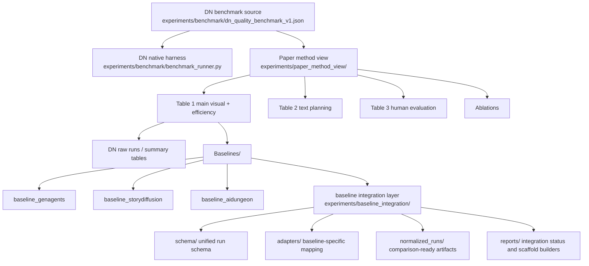

# DN Current Benchmark Stack

## Current interpretation
- DN native benchmark harness is already the strongest runnable evaluation path
- paper-writing structure is separated from raw benchmark outputs
- external baselines are now being integrated through a normalization layer instead of being forced into one server API

## Current status by branch
- DN native runs: ready
- GenAgents: loader smoke passed, live inference pending API key
- StoryDiffusion: environment understood, blocked on current machine for real runs
- AIDungeon: conceptually strong, but legacy runtime makes it a later-priority execution target
