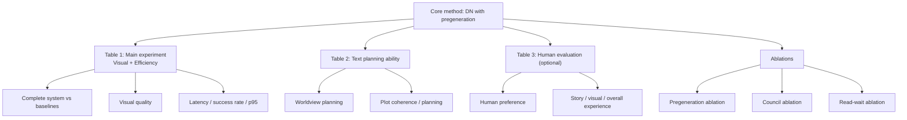

# Experiment Structure

```mermaid
flowchart TD
    A["Core method: DN with pregeneration"] --> B["Table 1: Main experiment\nVisual + Efficiency"]
    A --> C["Table 2: Text planning ability"]
    A --> D["Table 3: Human evaluation (optional)"]
    A --> E["Ablations"]

    B --> B1["Complete system vs baselines"]
    B --> B2["Visual quality"]
    B --> B3["Latency / success rate / p95"]

    C --> C1["Worldview planning"]
    C --> C2["Plot coherence / planning"]

    D --> D1["Human preference"]
    D --> D2["Story / visual / overall experience"]

    E --> E1["Pregeneration ablation"]
    E --> E2["Council ablation"]
    E --> E3["Read-wait ablation"]
```
